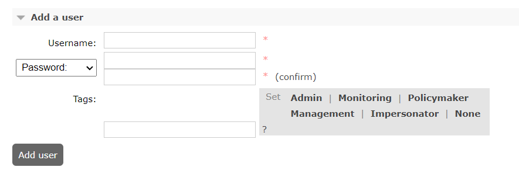
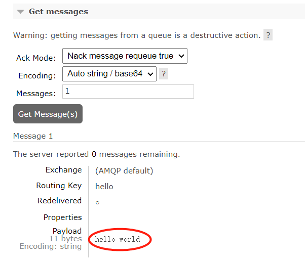
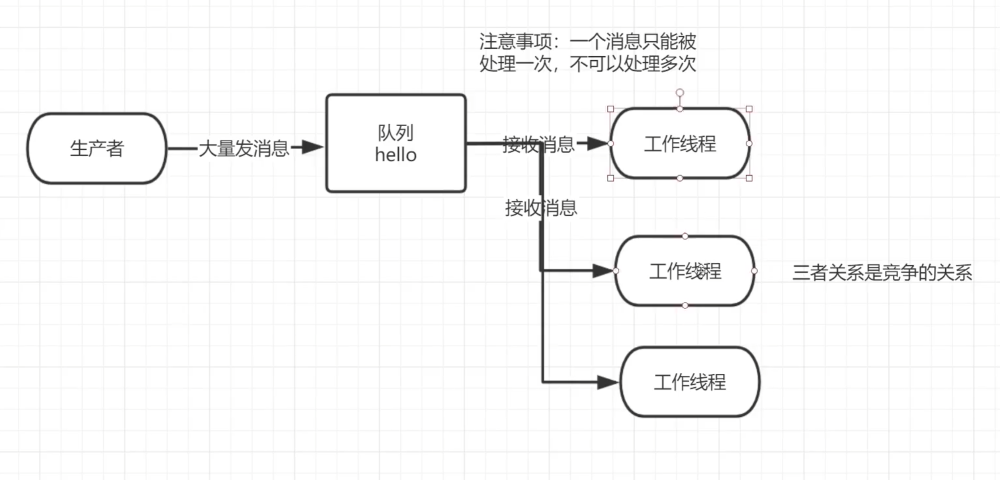
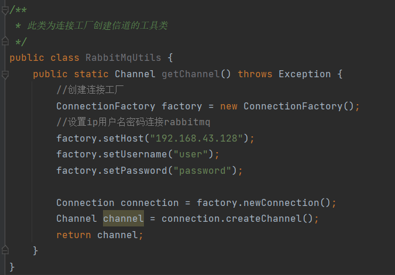
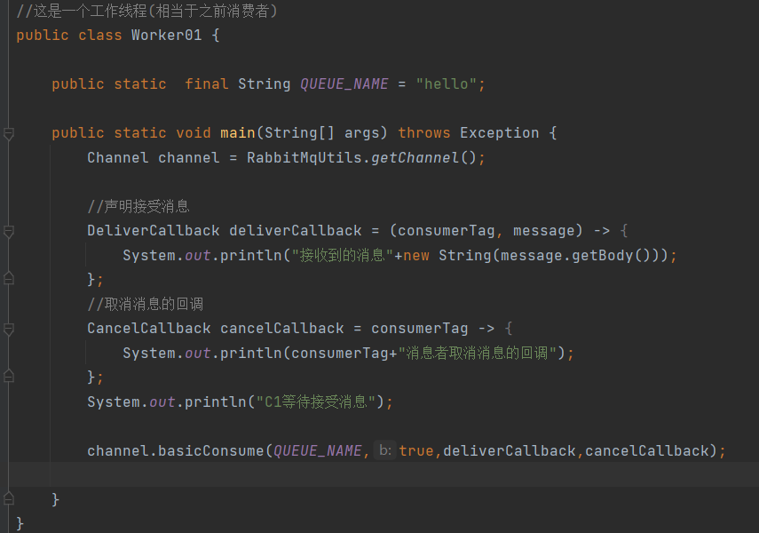
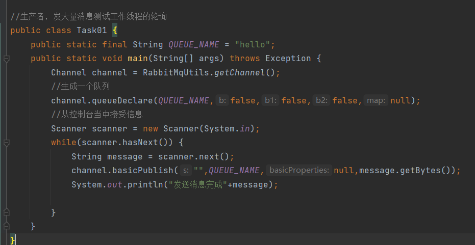
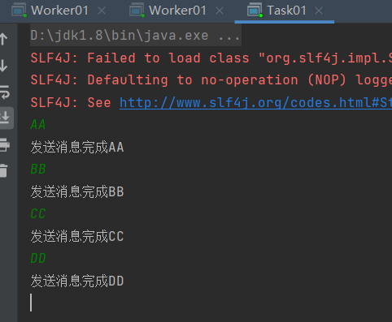
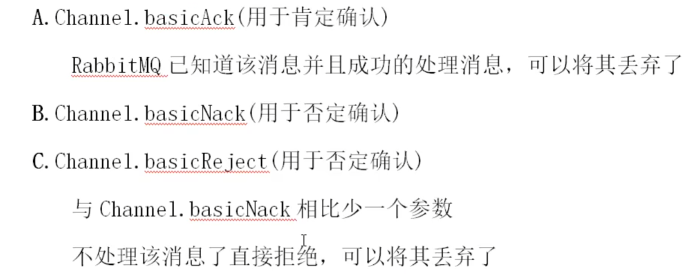
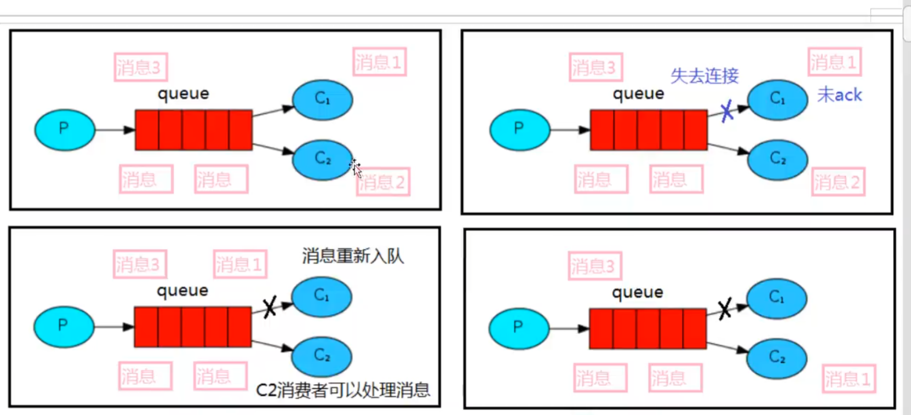
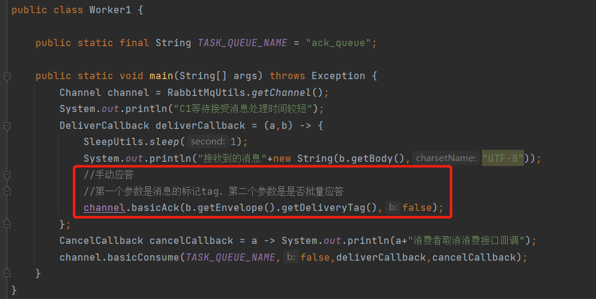

# RabbitMQ
###### 本次版本使用3.9
#四大核心概念
###### 生产者
产生数据发送消息的程序是生产者

###### 交换机
交换机是 RabbitMQ 非常重要的一个部件，一方面它接收来自生产者的消息，另一方面它将消息 推送到队列中。交换机必须确切知道如何处理它接收到的消息，是将这些消息推送到特定队列还是推 送到多个队列，亦或者是把消息丢弃，这个得有交换机类型决定

###### 队列
队列是 RabbitMQ 内部使用的一种数据结构，尽管消息流经 RabbitMQ 和应用程序，但它们只能存 储在队列中。队列仅受主机的内存和磁盘限制的约束，本质上是一个大的消息缓冲区。许多生产者可 以将消息发送到一个队列，许多消费者可以尝试从一个队列接收数据。这就是我们使用队列的方式

###### 消费者
消费与接收具有相似的含义。消费者大多时候是一个等待接收消息的程序。请注意生产者，消费 者和消息中间件很多时候并不在同一机器上。同一个应用程序既可以是生产者又是可以是消费者。


#1 工作原理    
    

* Broker

接收和分发消息的应用，RabbitMQ Server 就是 Message Broker

* Virtual host

出于多租户和安全因素设计的，把 AMQP 的基本组件划分到一个虚拟的分组中，类似 于网络中的 namespace 概念。当多个不同的用户使用同一个 RabbitMQ server 提供的服务时，可以划分出 多个 vhost，每个用户在自己的 vhost 创建 exchange／queue 等

* Connection

publisher／consumer 和 broker 之间的 TCP 连接

* Channel

如果每一次访问 RabbitMQ 都建立一个 Connection，在消息量大的时候建立 TCP Connection 的开销将是巨大的，效率也较低。Channel 是在 connection 内部建立的逻辑连接，如果应用程 序支持多线程，通常每个 thread 创建单独的 channel 进行通讯，AMQP method 包含了 channel id 帮助客 户端和 message broker 识别 channel，所以 channel 之间是完全隔离的。Channel 作为轻量级的 Connection 极大减少了操作系统建立 TCP connection 的开销

* Exchange

message 到达 broker 的第一站，根据分发规则，匹配查询表中的 routing key，分发 消息到 queue 中去。常用的类型有：direct (point-to-point), topic (publish-subscribe) and fanout (multicast)

* Queue

消息最终被送到这里等待 consumer 取走

* Binding

exchange 和 queue 之间的虚拟连接，binding 中可以包含 routing key，Binding 信息被保 存到 exchange 中的查询表中，用于 message 的分发依据

* RoutingKey  
路由键，生产者将消息发送给交换器的时候，会发送一个RoutingKey，用来指定路由规则，这样交换器就知道把消息发送到哪个队列。路由键通常为一个“.”分割的字符串，例如“com.rabbitmq”。   

#2 安装  
``
docker pull rabbitmq:3
``
   
```
docker run -d -v /opt/rabbitmq/data:/var/lib/rabbitmq -p 5672:5672 -p 15672:15672 --name rabbitmq --restart=always --hostname myRabbit    rabbitmq:3
```
   
安装完成后运行插件后可以访问网页的rabbitmq管理页面，输入默认账号密码guest guest      
     
    


   
每一个vhost的仓库和交换机是不一样的   

###### 添加用户  
  
###### 设置用户权限   
  

#3 java使用rabbitmq   
1. 导入依赖     
```
<dependencies>
<dependency>
<groupId>com.rabbitmq</groupId>
<artifactId>amqp-client</artifactId>
<version>5.8.0</version>
</dependency>
<dependency>
<groupId>commons-io</groupId>
<artifactId>commons-io</artifactId>
<version>2.6</version>
</dependency>
</dependencies>
```
2. 写生产者代码  
    
信道连接队列，这个例子只是个简单的入门程序，不然信道和队列之间还有个交换机       
     
参数解析:   
``s: 队列名称 b: 是否持久化  b1: 是否排他  b2: 是否自动删除  DeclareOK:  队列参数``   

   
参数解析:   
``s:发送到哪个交换机 s1:路由的Key值是哪个 本次是队列的名称 basicProperties:其他参数信息 bytes:要发送的消息的二进制形式``

完整代码如下:   
    

   
   
4. 写消费者代码   
前面的代码和生产者的代码一样   
    
参数解析:
``s: 消费的队列名字 b: 消费成功后是否自动应答 s1:消费者未成功消费的回调 Consumer: 消费者取消消费的回调``   
   

###### 消费者未成功消费的回调
   
###### 消费者取消消费的回调   
  

完整代码:    
   

 

#4 工作线程
## 4，1 轮询
**多个工作线程线程接受消息采用轮询接收消息，他们之间是竞争关系**      
**一个消息只能被处理一次，不可以处理多次**
      
#### 测试轮询分发消息     
###### 工具类   
    
###### 工作线程代码  
   
###### 生产者代码
   
###### 测试轮询结果  
   
    
     
###### 说明了工作队列是轮询分发消息的   


## 4.2 消息应答
为了保证消息在发送过程不丢失，rabbitmq引入消费应答机制，消费者在接收到消息并且处理该消息后，告诉rabbitmq它已经处理了，rabbitmq可以把该消息删除了  
###### 消息应答的方法
应答分为自动应答和手动应答，一般都是用手动应答   
  
* Channel.basicAck(用于肯定确认，RabbitMQ已经知道该消息并且成功的处理消息，可以将其丢弃了)
* Channel.basicNack(用于否定确认：否定确认就是不处理消息直接丢弃)     
* Channel.basicReject(也是否定确认，比basickNack()少了一个参数，就是multipe)    
* multipe就是是否批量处理，一般是不开启的，批量应答会导致前面的未应答的消息都会被确认收到消息应答   

###### 消息自动重新入队  
**消息在手动应答时是不丢失的，会放回队列中重新消费**   
```发现有连接断开时，会将断开连接的消息重新入队，交给其他消费者处理信息```
     

###### 消息手动应答代码 
工作线程上(消费者)开启手动应答
    

## 4.3 RabbitMQ持久化
###### 队列持久化    
```java
channel.queueDeclare(队列名,true,false,false,null);
第二个参数为true就是开启队列持久化  
```
  
  
###### 消息持久化   
队列持久化但是消息不持久化的话也一样会消息丢失  
     

###### 不公平分发--也就是有能力者优先
```java
在消费者的代码下更改:   
channel.basicQos(1);   
设置参数，改为不公平分发，0的话是轮询分发，1的话是不公平分发   
```
  
###### 预取值——直接指定消费者可以拿到几条消息

```java
channel.basicQos(预取值);  
```
这个预取值是指定了信道的堆积消息处理数，而不是只能消费多少条      

