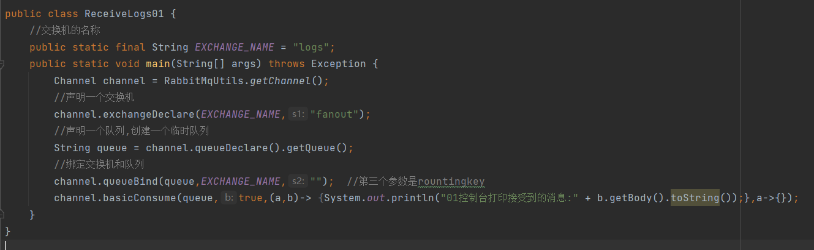
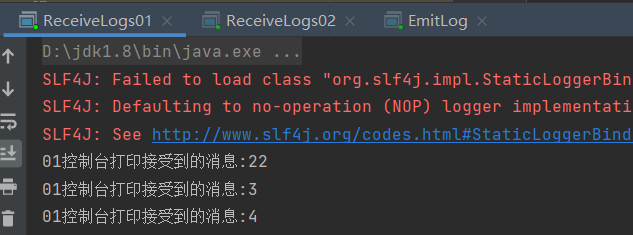

# 交换机


# 发布订阅模式/扇出交换机/广播  fanout
对于消息发布者而言它只负责把消息发布出去，甚至它也不知道消息是发到哪个queue，消息通过exchange到达queue，exchange的职责非常简单，就是一边接收发布者的消息一边把这些消息推到queue中。     

而exchange是怎么知道消息应该推到哪个queue呢，这就要通过绑定queue与exchange时的routingkey了(binding中可以包含rounting key)，通过代码进行绑定并且指定routingkey，下面有一张关系图,p(发布者) —> x(exchange) bindding(绑定关系也就是我们的routingkey) 红色代表着queue     
    

**RabbitMQ常用的交换器常用类型有direct、topic、fanout、headers四种**     

声明一个交换机的代码如下：  
```java
channel.exchangeDeclare(EXCHANGE_NAME,"fauout");
第一个参数是交换机的名字，第二个参数是交换机的类型  
```


##### 消费者代码
    
##### 生产者代码
      
##### 运行结果
  
  
  
  

和微信公众号类似，发布了，订阅者都能接收到相同的消息  


# 直接交换机/路由模式  direct
###### 和扇出交换机fanout不同的在于不同的消费者的rounting key不一样

queryBind()方法   
有三个参数，第一个是队列名称，第二个是交换机名称，第三个就是rounting key    
消费者代码:    
   
生产者代码:     
      


# Topic交换机  
队列绑定键 *和#     
``#代表0~多个单词  *代表一个单词``      
如果只有一个#那就是fanout的广播模式。如果只有一个*那就是direct模式，所以主题模式也包含了fanout和direct    
绑定键之间要加.       

### 示例代码如下:
##### 消费者代码
    


