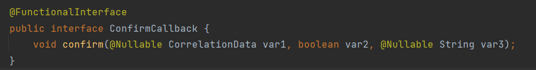
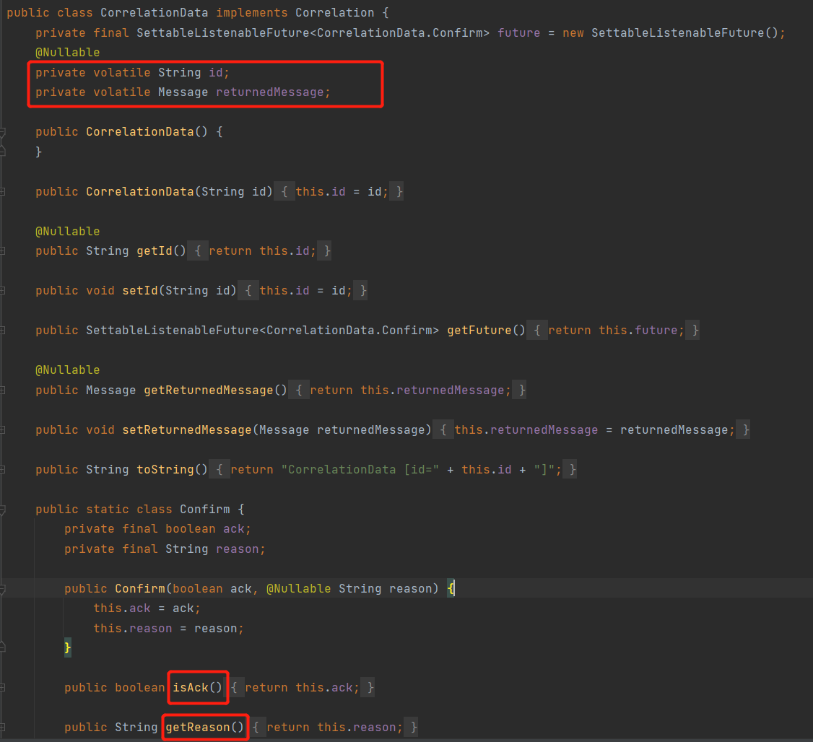

# 发布确认
在队列持久化和发布的消息持久化后还要保证发布确认才能真正保证消息不丢失   
消息保存在磁盘后mq要和生产者说一声，确认发布成功了   
  

#### 单个确认发布  
``同步确认发布，发一条确认一条``     
   

#### 批量确认发布
``也是同步确认发布，性能高``
比单个确认发布快，但是发生故障导致发布出现问题时，不知道哪个消息出现问题了，我们必须将整个批处理保存在内存中，以记录重要的信息而后重新发布消息   


## 异步批量确认
**性价比最高，可靠效率高，利用回调函数来达到消息可靠性传输，通过函数回调来保证是否投递成功**    
    

代码如下：

* 编写监听器，addConfirmListener,有两个回调函数作为参数，一个是监听成功的回调另一个是监听失败的回调
      
    
异步确认消息的完整代码如下:  
  

  
可以看出都已经发完了，监听器还没监听完，于是引出下列问题  

### 如何处理异步未确认消息   
最好的解决方案就是把未确认的消息放到一个基于内存的能被发布线程访问的队列，比如说用**ConcurrentLinkedQueue**这个队列在confirm callbacks与发布线程之间进行消息的传递     
   


### 三种发布确认的对比
1. 单个发布消息
同步等待确认，简单，吞吐量非常有限    
2. 批量发布消息 
批量同步等待确认，简单，合理的吞吐量，一旦出现问题很难判断出是哪条消息出现了问题    
3. 异步处理：
最佳性能和资源使用，在出现错误的情况下可以很好的控制，实现稍复杂    


# 高级篇
###### 背景
在生产环境中由于一些不明原因导致rabbitmq重启，导致消息丢失，这种情况需要手动处理和回复。在极其极端的情况下，rabbitmq集群都不可用的时候，无法投递的消息要如何处理呢？   

##### 发布确认机制，springboot版本实现定时任务对未成功的消息进行投递
     
##### 代码架构图（如果交换机接受不到消息，我们要怎么处理）  
     

#####  配置文件
在配置文件当中需要添加   
```
javaspring.rabbitmq.publisher-confirm-type=correlated
```
* NONE 值是禁用发布确认模式，是默认值
* CORRELATED 值是发布消息成功到交换器后会触发回调方法
* SIMPLE 值经测试有两种效果，其一效果和 CORRELATED 值一样会触发回调方法，其二在发布消息成功后使用 rabbitTemplate 调用 waitForConfirms 或 waitForConfirmsOrDie 方法等待 broker 节点返回发送结果，根据返回结果来判定下一步的逻辑，要注意的点是 waitForConfirmsOrDie 方法如果返回 false 则会关闭 channel，则接下来无法发送消息到 broker;  
* 

### 核心代码是回调接口  
消息生产者的回调接口，实现一个RabbitTemplate.ConfirmCallback接口，重写confirm方法   
```java

@Component
@Slf4j
public class MyCallBack implements RabbitTemplate.ConfirmCallback {

    /*
      因为实现的是一个类的内部接口，MyCallBack并不在RabbitTemplate中，我们需要把MyCallBack注入到类中
     */
    @Autowired
    private RabbitTemplate rabbitTemplate;
    
    @PostConstruct
    public void init() {
        rabbitTemplate.setConfirmCallback(this);
    }
    
    /**
     * 交换机不管是否收到消息的一个回调方法
     *
     * @param correlationData 保存消息id和相关数据
     * @param ack             交换机是否收到消息
     * @param cause           消息发送失败的原因
     */
    @Override
    public void confirm(CorrelationData correlationData, boolean ack, String cause) {
        String id = correlationData != null ? correlationData.getId() : "";
        if (ack) {
            log.info("交换机已经收到 id 为:{}的消息", id);
        } else {
            log.info("交换机还未收到 id 为:{}消息，原因:{}", id, cause);
        }
    }
}
```

confirm方法里面的第一个参数CorrelationData是由生产者发送的

```java
    @GetMapping("sendMessage/{message}")
    public void sendMessage(@PathVariable String message) {
        //指定消息 id 为 1
        CorrelationData correlationData1=new CorrelationData("1");
        String routingKey="key1";
        rabbitTemplate.convertAndSend(CONFIRM_EXCHANGE_NAME,routingKey,message+routingKey,correlationData1);
        }
```

###### ConfirmCallback接口里面的一些源码  
      
---   
      


