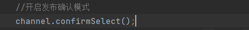
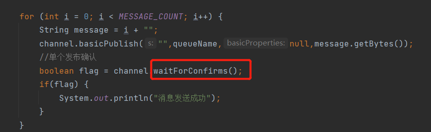
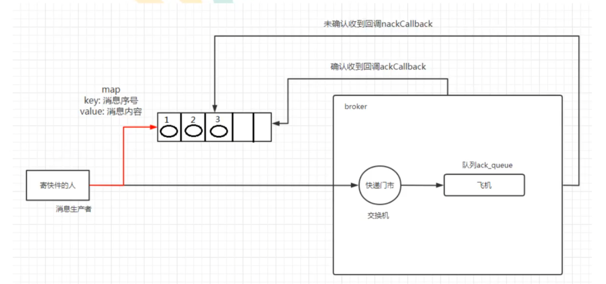
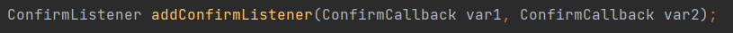
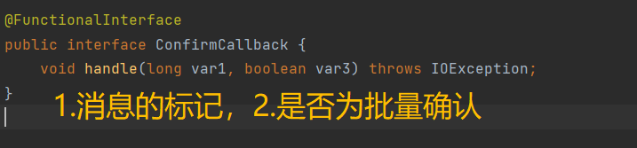
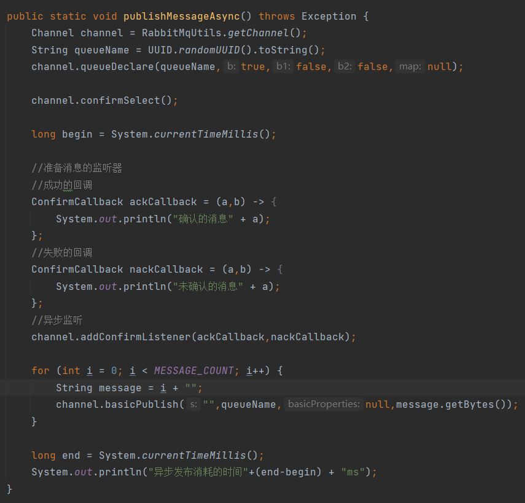
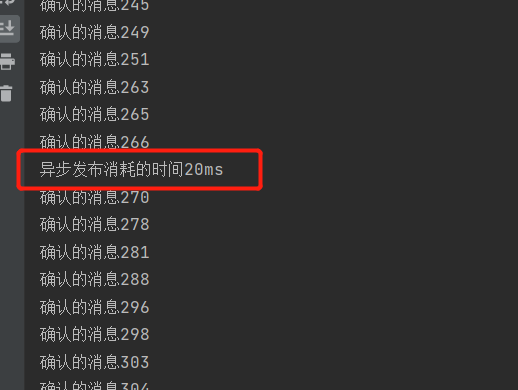
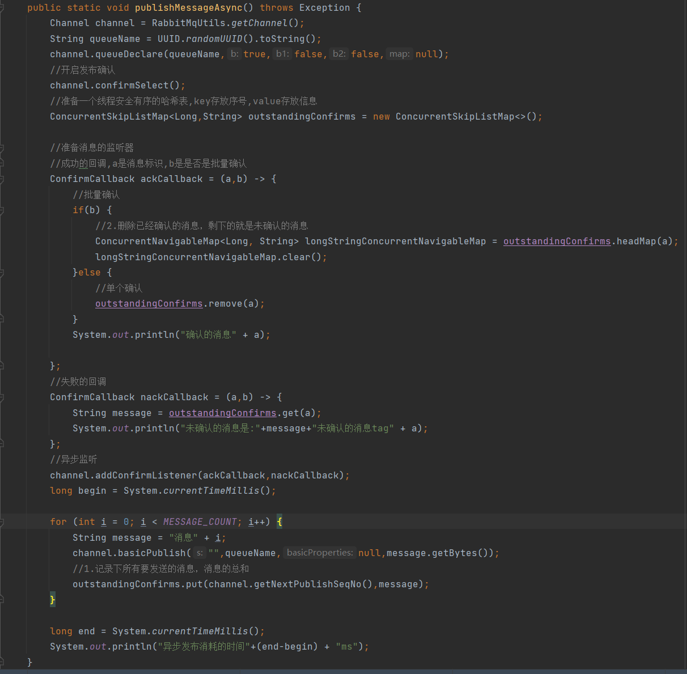
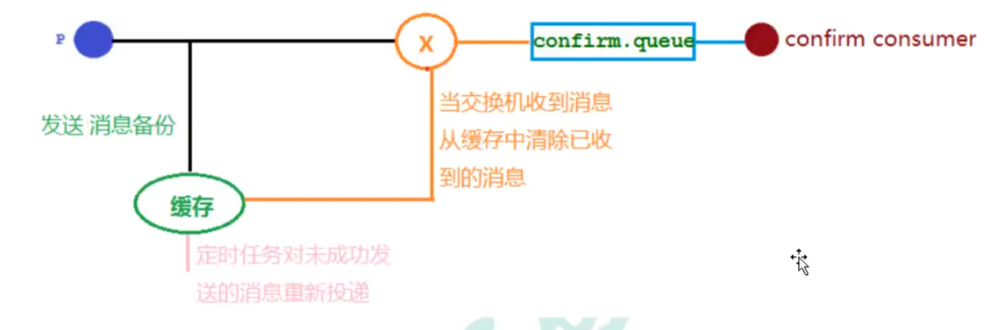
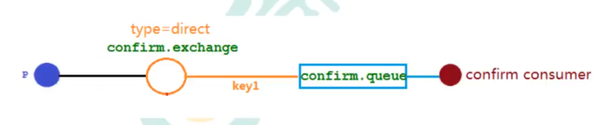

# 发布确认
在队列持久化和发布的消息持久化后还要保证发布确认才能真正保证消息不丢失   
消息保存在磁盘后mq要和生产者说一声，确认发布成功了   
  

#### 单个确认发布  
``同步确认发布，发一条确认一条``     
   

#### 批量确认发布
``也是同步确认发布，性能高``
比单个确认发布快，但是发生故障导致发布出现问题时，不知道哪个消息出现问题了，我们必须将整个批处理保存在内存中，以记录重要的信息而后重新发布消息   

## 异步批量确认
**性价比最高，可靠效率高，利用回调函数来达到消息可靠性传输，通过函数回调来保证是否投递成功**    
    

代码如下：

* 编写监听器，addConfirmListener,有两个回调函数作为参数，一个是监听成功的回调另一个是监听失败的回调
      
    
异步确认消息的完整代码如下:  
  

  
可以看出都已经发完了，监听器还没监听完，于是引出下列问题  

### 如何处理异步未确认消息   
最好的解决方案就是把未确认的消息放到一个基于内存的能被发布线程访问的队列，比如说用**ConcurrentLinkedQueue**这个队列在confirm callbacks与发布线程之间进行消息的传递     
   

### 三种发布确认的对比
1. 单个发布消息
同步等待确认，简单，吞吐量非常有限    
2. 批量发布消息 
批量同步等待确认，简单，合理的吞吐量，一旦出现问题很难判断出是哪条消息出现了问题    
3. 异步处理：
最佳性能和资源使用，在出现错误的情况下可以很好的控制，实现稍复杂    

# 高级篇
##### 发布确认机制，springboot版本实现定时任务对未成功的消息进行投递
     
##### 代码架构图  
     