# 1.死信队列   
##### 概念  
死信就是没有被消费的消息，要处理这样的死信要用到死信队列   
##### 应用场景
为了保证订单业务的消息数据不丢失，需要使用到RabbitMQ的死信队列机制，当消息消费发生异常时，将消息投入死信队列中   
下单后支付超时，订单自动失效   

##### 死信的来源
* 消息TTL（存活时间）过期   
* 队列达到最大长度(队列满了，无法再添加数据到mq中)
* 消息被拒绝(basic,reject/basic.nack)并且requeue=false


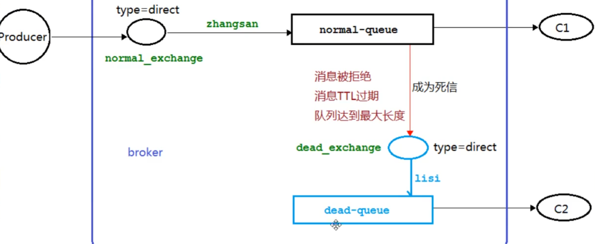     

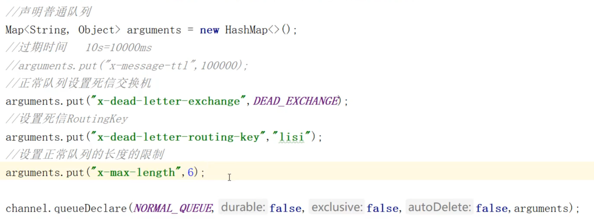     

**如果要中途改队列的属性，要记得删掉队列重新创建队列才能生效**    

### 死信队列使用代码：
##### 消费者C1代码(复杂，要对消费普通队列的消息和对死信进行处理)
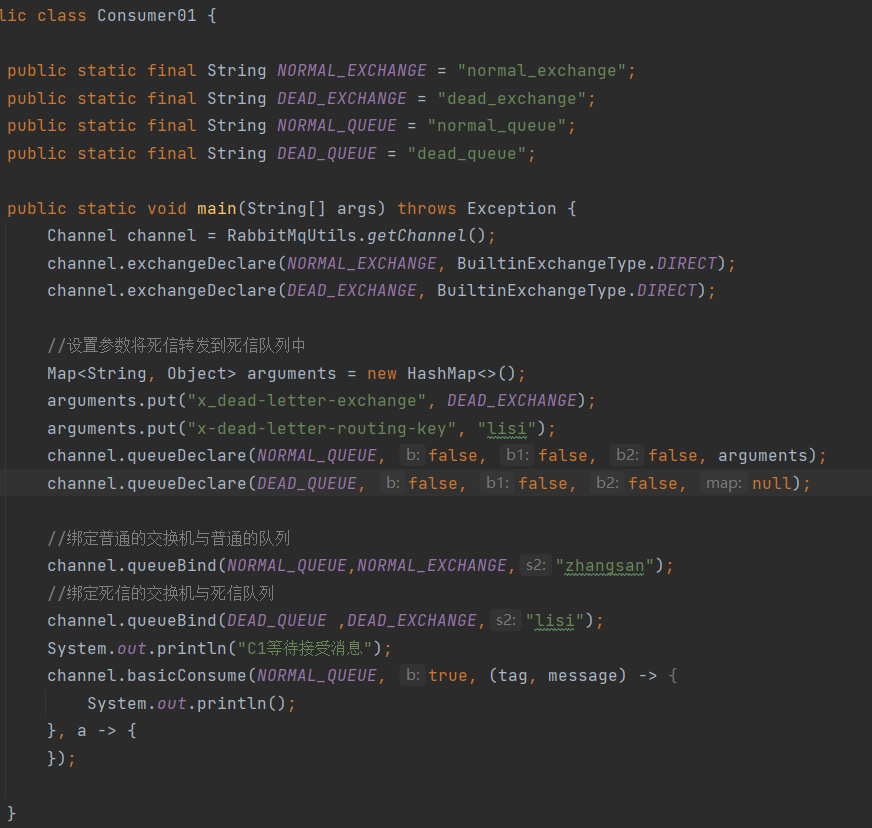   
队列要传入参数:死信交换机和死信交换机和死信队列的rounting key    

传参数原码解析：
首先看queueDeclare方法的第五个参数，是个Map<String,Object>类型的参数   
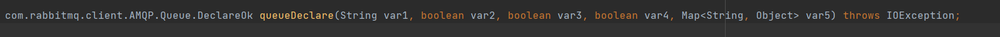     
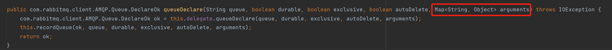   

源码未完待续：后面再调试  

##### 消费者C2代码(简单，只是消费死信队列里面的消息而已)
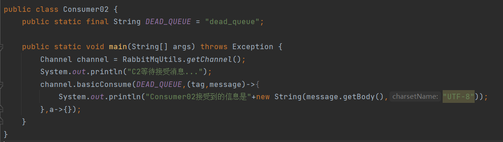   

##### 生产者代码
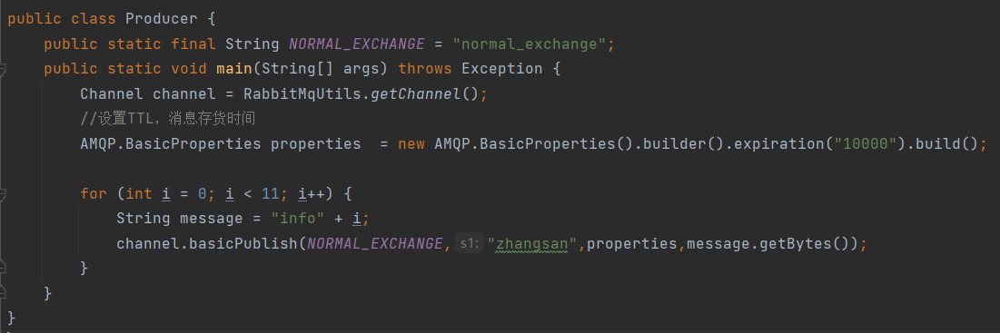  

设置TTL存活时间以及其他参数的原理：      
在生产者发消息的时候设置，首先是basicPublish方法的第三个参数是BasicProperties，点进去BasicProperties类{父类是AMQP接口(高级消息队列协议Advanced Message Queuing Protocol)}我们可以看到一些参数      
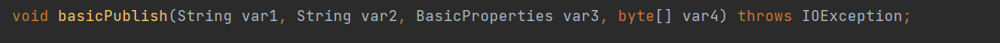    
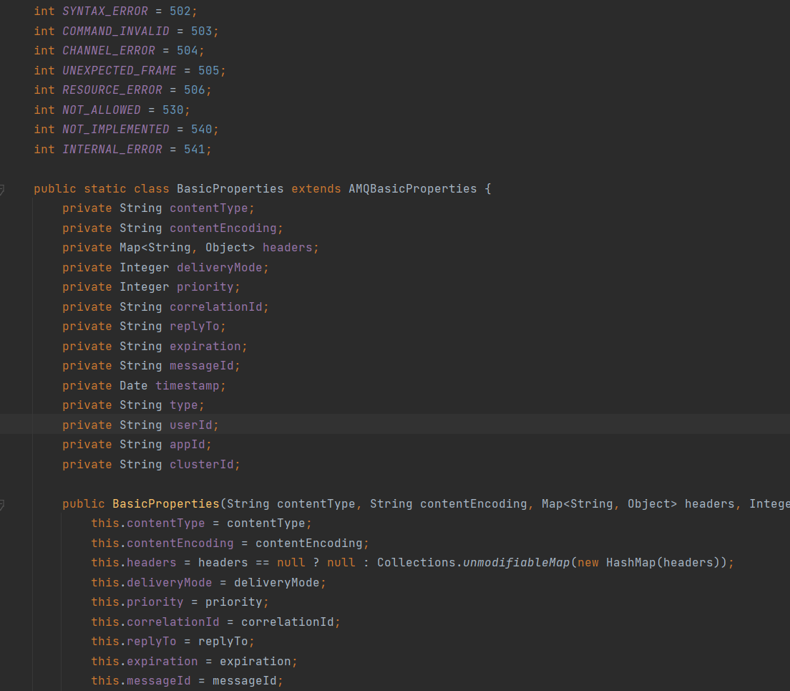     

BasicProperties类的源码使用了建造者模式来链式构建参数    
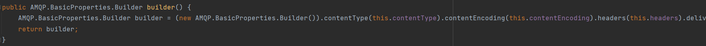     
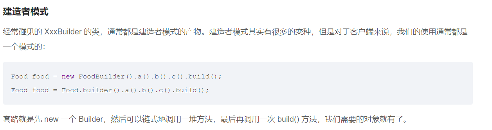     
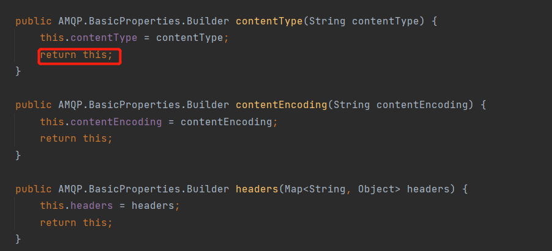     
builder()的build()方法可以返回这些参数      
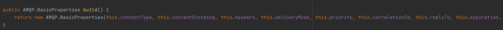     


##### 演示结果，当C1宕机后，10秒后C2消费死信队列中的消息   
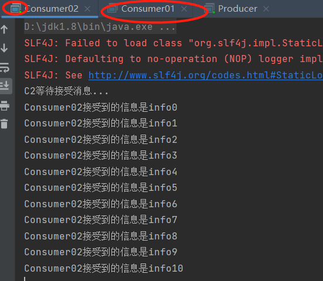    


#### 队列满了的情况
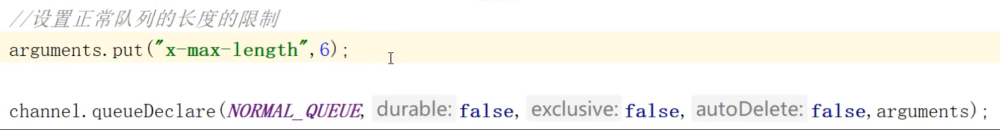    
#### 消息被拒的情况
```java
在消息未成功消费的回调函数中写如下代码：
channel.basicReject(message.getEnvelope().getDeliveryTag(),false);  
```
BasicReject方法第一个参数是消息的DeliveryTag，对于每个Channel来说，每个消息都会有一个DeliveryTag，一般用接收消息的顺序来表示：1,2,3,4 等等。第二个参数是是否放回queue中，requeue   
  
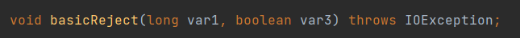  
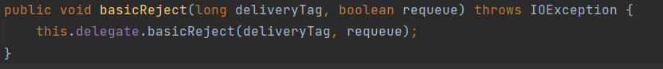   
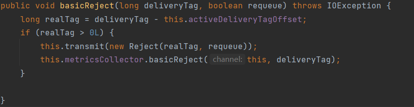     

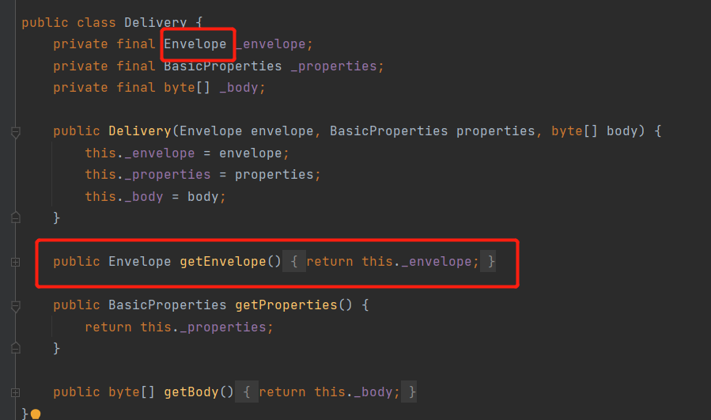       
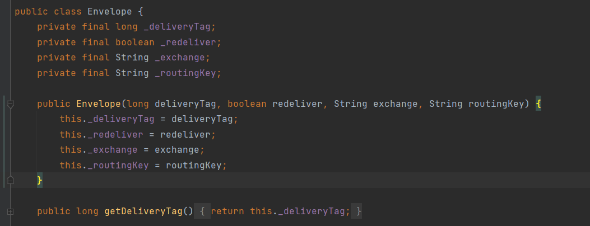      
  
实现代码如下:   
     

# 2.延迟队列  
