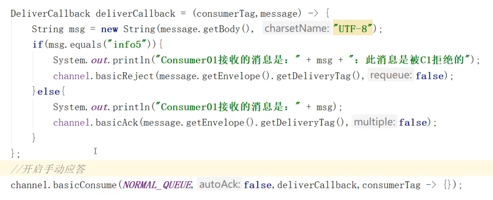

# 1.死信队列   
##### 概念  
死信就是没有被消费的消息，要处理这样的死信要用到死信队列   
##### 应用场景
为了保证订单业务的消息数据不丢失，需要使用到RabbitMQ的死信队列机制，当消息消费发生异常时，将消息投入死信队列中   
下单后支付超时，订单自动失效   

##### 死信的来源
* 消息TTL（存活时间）过期   
* 队列达到最大长度(队列满了，无法再添加数据到mq中)
* 消息被拒绝(basic,reject/basic.nack)并且requeue=false


     

     

**如果要中途改队列的属性，要记得删掉队列重新创建队列才能生效**    

### 死信队列使用代码：
##### 消费者C1代码(复杂，要对消费普通队列的消息和对死信进行处理)
   
队列要传入参数:死信交换机和死信交换机和死信队列的rounting key    

传参数原码解析：
首先看queueDeclare方法的第五个参数，是个Map<String,Object>类型的参数   
     
   

源码未完待续：后面再调试  

##### 消费者C2代码(简单，只是消费死信队列里面的消息而已)
   

##### 生产者代码
  

设置TTL存活时间以及其他参数的原理：      
在生产者发消息的时候设置，首先是basicPublish方法的第三个参数是BasicProperties，点进去BasicProperties类{父类是AMQP接口(高级消息队列协议Advanced Message Queuing Protocol)}我们可以看到一些参数      
    
     

BasicProperties类的源码使用了建造者模式来链式构建参数    
     
     
     
builder()的build()方法可以返回这些参数      
     


##### 演示结果，当C1宕机后，10秒后C2消费死信队列中的消息   
    


#### 队列满了的情况
    
#### 消息被拒的情况
```java
在消息未成功消费的回调函数中写如下代码：
channel.basicReject(message.getEnvelope().getDeliveryTag(),false);  
```
BasicReject方法第一个参数是消息的DeliveryTag，对于每个Channel来说，每个消息都会有一个DeliveryTag，一般用接收消息的顺序来表示：1,2,3,4 等等。第二个参数是是否放回queue中，requeue   
  
  
   
     

       
      
  
实现代码如下:   
     

# 2.延迟队列(死信队列中的一种)  
### 延迟队列概念
延时队列，队列内部是有序的，最重要的特性就体现在它的延时属性上，延时队列中的元素是希望在指定时间到了以后或之前取出和处理   
**就是用来存放需要在指定时间被处理的元素的队列**

### 使用场景
   

### 整合springboot   
```java
<?xml version="1.0" encoding="UTF-8"?>
<project xmlns="http://maven.apache.org/POM/4.0.0" xmlns:xsi="http://www.w3.org/2001/XMLSchema-instance"
         xsi:schemaLocation="http://maven.apache.org/POM/4.0.0 https://maven.apache.org/xsd/maven-4.0.0.xsd">
    <modelVersion>4.0.0</modelVersion>
    <groupId>com.example</groupId>
    <artifactId>springboot_rabbitmq</artifactId>
    <version>0.0.1-SNAPSHOT</version>
    <name>springboot_rabbitmq</name>
    <description>springboot_rabbitmq</description>

    <properties>
        <java.version>1.8</java.version>
        <project.build.sourceEncoding>UTF-8</project.build.sourceEncoding>
        <project.reporting.outputEncoding>UTF-8</project.reporting.outputEncoding>
        <spring-boot.version>2.3.7.RELEASE</spring-boot.version>
    </properties>

    <dependencies>
        <dependency>
            <groupId>org.springframework.boot</groupId>
            <artifactId>spring-boot-starter</artifactId>
        </dependency>
        <dependency>
            <groupId>org.springframework.boot</groupId>
            <artifactId>spring-boot-starter-web</artifactId>
        </dependency>
        <dependency>
            <groupId>org.springframework.boot</groupId>
            <artifactId>spring-boot-starter-test</artifactId>
            <scope>test</scope>
            <exclusions>
                <exclusion>
                    <groupId>org.junit.vintage</groupId>
                    <artifactId>junit-vintage-engine</artifactId>
                </exclusion>
            </exclusions>
        </dependency>

        <!--RabbitMQ 依赖-->
        <dependency>
            <groupId>org.springframework.boot</groupId>
            <artifactId>spring-boot-starter-amqp</artifactId>
        </dependency>
        <dependency>
            <groupId>com.alibaba</groupId>
            <artifactId>fastjson</artifactId>
            <version>1.2.47</version>
        </dependency>
        <dependency>
            <groupId>org.projectlombok</groupId>
            <artifactId>lombok</artifactId>
        </dependency>

        <!--swagger-->
        <dependency>
            <groupId>io.springfox</groupId>
            <artifactId>springfox-swagger2</artifactId>
            <version>3.0.0</version>
        </dependency>
        <dependency>
            <groupId>io.springfox</groupId>
            <artifactId>springfox-swagger-ui</artifactId>
            <version>3.0.0</version>
        </dependency>
        <!--RabbitMQ 测试依赖-->
        <dependency>
            <groupId>org.springframework.amqp</groupId>
            <artifactId>spring-rabbit-test</artifactId>
            <scope>test</scope>
        </dependency>
    </dependencies>

    <dependencyManagement>
        <dependencies>
            <dependency>
                <groupId>org.springframework.boot</groupId>
                <artifactId>spring-boot-dependencies</artifactId>
                <version>${spring-boot.version}</version>
                <type>pom</type>
                <scope>import</scope>
            </dependency>
        </dependencies>
    </dependencyManagement>

    <build>
        <plugins>
            <plugin>
                <groupId>org.apache.maven.plugins</groupId>
                <artifactId>maven-compiler-plugin</artifactId>
                <version>3.8.1</version>
                <configuration>
                    <source>1.8</source>
                    <target>1.8</target>
                    <encoding>UTF-8</encoding>
                </configuration>
            </plugin>
            <plugin>
                <groupId>org.springframework.boot</groupId>
                <artifactId>spring-boot-maven-plugin</artifactId>
                <version>2.3.7.RELEASE</version>
                <configuration>
                    <mainClass>com.example.springboot_rabbitmq.SpringbootRabbitmqApplication</mainClass>
                </configuration>
                <executions>
                    <execution>
                        <id>repackage</id>
                        <goals>
                            <goal>repackage</goal>
                        </goals>
                    </execution>
                </executions>
            </plugin>
        </plugins>
    </build>

</project>

```    

### 队列TTL(springboot编写)
###### 代码架构图   
     
中间的这些队列交换机的声明，队列和交换机的绑定等，写在配置文件中       
```java
@Configuration
public class TTLQueueConfig {

    //普通队列和交换机名称
    public static final  String QUEUE_A  = "QA";
    public static final  String QUEUE_B  = "QB";
    public static final String  X_EXCHANGE = "X";
    //死信队列和死信交换机
    public static  final  String Y_DEAD_LETTER_EXCHANGE = "Y";
    public static  final  String DEAD_LETTER_QUEUE = "QD";


    //声明X交换机别名
    @Bean("xExchange")
    public DirectExchange xExchange() {
        return new DirectExchange(X_EXCHANGE);
    }
    //声明Y交换机别名
    @Bean("yExchange")
    public DirectExchange yExchange() {
        return new DirectExchange(Y_DEAD_LETTER_EXCHANGE);
    }

    //声明普通队列A,durable:持久化
    @Bean("queueA")
    public Queue queueA() {

        Map<String,Object> arguments = new HashMap<>(3);
        //设置普通队列和延迟交换机的绑定(routing key)
        arguments.put("x-dead-letter-exchange",Y_DEAD_LETTER_EXCHANGE);
        arguments.put("x-dead-letter-routing-key","YD");
        //延时10秒
        arguments.put("x-message-ttl",10000);
        return QueueBuilder.durable(QUEUE_A).withArguments(arguments).build();
    }

    //声明普通队列B
    @Bean("queueB")
    public Queue queueB() {

        Map<String,Object> arguments = new HashMap<>(3);
        //设置普通队列和延迟交换机的绑定(routing key)
        arguments.put("x-dead-letter-exchange",Y_DEAD_LETTER_EXCHANGE);
        arguments.put("x-dead-letter-routing-key","YD");
        //延时10秒
        arguments.put("x-message-ttl",40000);
        return QueueBuilder.durable(QUEUE_B).withArguments(arguments).build();
    }

    //声明死信队列
    @Bean("queueD")
    public Queue queueD() {
        return QueueBuilder.durable(DEAD_LETTER_QUEUE).build();
    }

    //绑定X交换机和QA队列
    @Bean
    public Binding queueaBindingX(@Qualifier("queueA") Queue queueA,
                                  @Qualifier("xExchange") DirectExchange xExchange) {
        return BindingBuilder.bind(queueA).to(xExchange).with("XA");
    }

    //绑定X交换机和QB队列
    @Bean
    public Binding queuebBindingX(@Qualifier("queueB") Queue queue1B,
                                  @Qualifier("xExchange") DirectExchange xExchange) {
        return BindingBuilder.bind(queue1B).to(xExchange).with("XB");
    }

    //绑定Y交换机和QD队列
    @Bean
    public Binding deadLetterBindingQAD(@Qualifier("queueD") Queue queueD,
                                        @Qualifier("yExchange") DirectExchange yExchange) {
        return BindingBuilder.bind(queueD).to(yExchange).with("YD");
    }


}
```

  
相关方法   
      
      
     
     


### 生产者代码
    

相关方法的源码:   
  
```java
    public void convertAndSend(String exchange, String routingKey, Object object) throws AmqpException {
        this.convertAndSend(exchange, routingKey, object, (CorrelationData)null);
        }

    public void convertAndSend(String exchange, String routingKey, Object object, @Nullable CorrelationData correlationData) throws AmqpException {
        this.send(exchange, routingKey, this.convertMessageIfNecessary(object), correlationData);
        }


    public void send(String exchange, String routingKey, Message message, @Nullable CorrelationData correlationData) throws AmqpException {
        this.execute((channel) -> {
            this.doSend(channel, exchange, routingKey, message, (this.returnCallback != null || correlationData != null && StringUtils.hasText(correlationData.getId())) && (Boolean)this.mandatoryExpression.getValue(this.evaluationContext, message, Boolean.class), correlationData);
            return null;
        }, this.obtainTargetConnectionFactory(this.sendConnectionFactorySelectorExpression, message));
    }
    
    
```
### 消费者死信队列代码
    
这里的信道得导入rabbitmq包下的信道，不要导成nio包下的了   
### 演示结果
因为两个普通队列的消息没有被消费变成了死信队列，所以我们的死信队列消费者可以接受到消息   
      

# 延迟队列优化
如果每次多一个延迟消息的需求就创建一个队列，当需求很多的时候，就要增加很多队列，所以有如下的优化方案来解决这些问题   

方法是增加一个通用队列，由生产者自定义延迟时间，但是后期难以维护    

    
返回Message，然后可以使用getMessageProperties()来设置参数      
   


###  在消息属性上设置ttl的方式，是有问题的，消息可能不会按时死亡，因为RabbitMQ指挥检查第一个消息是否过期，如果国企则丢到死信队列，如果第一个消息的延时时长很长，而第二个消息的延时时长很短，第二个消息并不会优先得到执行   


# 基于插件的延迟队列   
 


# 优化级队列


# 惰性队列


