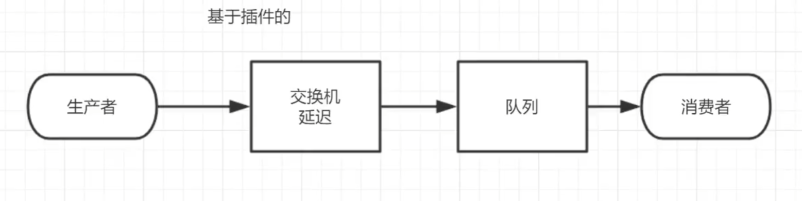

# 1.死信队列   
##### 概念  
死信就是没有被消费的消息，要处理这样的死信要用到死信队列   
##### 应用场景
为了保证订单业务的消息数据不丢失，需要使用到RabbitMQ的死信队列机制，当消息消费发生异常时，将消息投入死信队列中   
下单后支付超时，订单自动失效   

##### 死信的来源
* 消息TTL（存活时间）过期   
* 队列达到最大长度(队列满了，无法再添加数据到mq中)
* 消息被拒绝(basic,reject/basic.nack)并且requeue=false


     

     

**如果要中途改队列的属性，要记得删掉队列重新创建队列才能生效**    

### 死信队列使用代码：
##### 消费者C1代码(复杂，要对消费普通队列的消息和对死信进行处理)
   
队列要传入参数:死信交换机和死信交换机和死信队列的rounting key    

传参数原码解析：
首先看queueDeclare方法的第五个参数，是个Map<String,Object>类型的参数   
     
   
 
源码未完待续：后面再调试  

##### 消费者C2代码(简单，只是消费死信队列里面的消息而已)
   

##### 生产者代码
  

设置TTL存活时间以及其他参数的原理：      
在生产者发消息的时候设置，首先是basicPublish方法的第三个参数是BasicProperties，点进去BasicProperties类{父类是AMQP接口(高级消息队列协议Advanced Message Queuing Protocol)}我们可以看到一些参数      
    
     

BasicProperties类的源码使用了建造者模式来链式构建参数    
     
     
     
builder()的build()方法可以返回这些参数      
     


##### 演示结果，当C1宕机后，10秒后C2消费死信队列中的消息   
    


#### 队列满了的情况
    
#### 消息被拒的情况
```java
在消息未成功消费的回调函数中写如下代码：
channel.basicReject(message.getEnvelope().getDeliveryTag(),false);  
```
BasicReject方法第一个参数是消息的DeliveryTag，对于每个Channel来说，每个消息都会有一个DeliveryTag，一般用接收消息的顺序来表示：1,2,3,4 等等。第二个参数是是否放回queue中，requeue   
  
  
   
     

       
      
  
实现代码如下:   
     

# 2.延迟队列(死信队列中的一种)  
### 延迟队列概念
延时队列，队列内部是有序的，最重要的特性就体现在它的延时属性上，延时队列中的元素是希望在指定时间到了以后或之前取出和处理   
**就是用来存放需要在指定时间被处理的元素的队列**

### 使用场景
   

### 整合springboot   
```java
<?xml version="1.0" encoding="UTF-8"?>
<project xmlns="http://maven.apache.org/POM/4.0.0" xmlns:xsi="http://www.w3.org/2001/XMLSchema-instance"
         xsi:schemaLocation="http://maven.apache.org/POM/4.0.0 https://maven.apache.org/xsd/maven-4.0.0.xsd">
    <modelVersion>4.0.0</modelVersion>
    <groupId>com.example</groupId>
    <artifactId>springboot_rabbitmq</artifactId>
    <version>0.0.1-SNAPSHOT</version>
    <name>springboot_rabbitmq</name>
    <description>springboot_rabbitmq</description>

    <properties>
        <java.version>1.8</java.version>
        <project.build.sourceEncoding>UTF-8</project.build.sourceEncoding>
        <project.reporting.outputEncoding>UTF-8</project.reporting.outputEncoding>
        <spring-boot.version>2.3.7.RELEASE</spring-boot.version>
    </properties>

    <dependencies>
        <dependency>
            <groupId>org.springframework.boot</groupId>
            <artifactId>spring-boot-starter</artifactId>
        </dependency>
        <dependency>
            <groupId>org.springframework.boot</groupId>
            <artifactId>spring-boot-starter-web</artifactId>
        </dependency>
        <dependency>
            <groupId>org.springframework.boot</groupId>
            <artifactId>spring-boot-starter-test</artifactId>
            <scope>test</scope>
            <exclusions>
                <exclusion>
                    <groupId>org.junit.vintage</groupId>
                    <artifactId>junit-vintage-engine</artifactId>
                </exclusion>
            </exclusions>
        </dependency>

        <!--RabbitMQ 依赖-->
        <dependency>
            <groupId>org.springframework.boot</groupId>
            <artifactId>spring-boot-starter-amqp</artifactId>
        </dependency>
        <dependency>
            <groupId>com.alibaba</groupId>
            <artifactId>fastjson</artifactId>
            <version>1.2.47</version>
        </dependency>
        <dependency>
            <groupId>org.projectlombok</groupId>
            <artifactId>lombok</artifactId>
        </dependency>

        <!--swagger-->
        <dependency>
            <groupId>io.springfox</groupId>
            <artifactId>springfox-swagger2</artifactId>
            <version>3.0.0</version>
        </dependency>
        <dependency>
            <groupId>io.springfox</groupId>
            <artifactId>springfox-swagger-ui</artifactId>
            <version>3.0.0</version>
        </dependency>
        <!--RabbitMQ 测试依赖-->
        <dependency>
            <groupId>org.springframework.amqp</groupId>
            <artifactId>spring-rabbit-test</artifactId>
            <scope>test</scope>
        </dependency>
    </dependencies>

    <dependencyManagement>
        <dependencies>
            <dependency>
                <groupId>org.springframework.boot</groupId>
                <artifactId>spring-boot-dependencies</artifactId>
                <version>${spring-boot.version}</version>
                <type>pom</type>
                <scope>import</scope>
            </dependency>
        </dependencies>
    </dependencyManagement>

    <build>
        <plugins>
            <plugin>
                <groupId>org.apache.maven.plugins</groupId>
                <artifactId>maven-compiler-plugin</artifactId>
                <version>3.8.1</version>
                <configuration>
                    <source>1.8</source>
                    <target>1.8</target>
                    <encoding>UTF-8</encoding>
                </configuration>
            </plugin>
            <plugin>
                <groupId>org.springframework.boot</groupId>
                <artifactId>spring-boot-maven-plugin</artifactId>
                <version>2.3.7.RELEASE</version>
                <configuration>
                    <mainClass>com.example.springboot_rabbitmq.SpringbootRabbitmqApplication</mainClass>
                </configuration>
                <executions>
                    <execution>
                        <id>repackage</id>
                        <goals>
                            <goal>repackage</goal>
                        </goals>
                    </execution>
                </executions>
            </plugin>
        </plugins>
    </build>

</project>

```    

### 队列TTL(springboot编写)
###### 代码架构图   
     
中间的这些队列交换机的声明，队列和交换机的绑定等，写在配置文件中       
```java
@Configuration
public class TTLQueueConfig {

    //普通队列和交换机名称
    public static final  String QUEUE_A  = "QA";
    public static final  String QUEUE_B  = "QB";
    public static final String  X_EXCHANGE = "X";
    //死信队列和死信交换机
    public static  final  String Y_DEAD_LETTER_EXCHANGE = "Y";
    public static  final  String DEAD_LETTER_QUEUE = "QD";


    //声明X交换机别名
    @Bean("xExchange")
    public DirectExchange xExchange() {
        return new DirectExchange(X_EXCHANGE);
    }
    //声明Y交换机别名
    @Bean("yExchange")
    public DirectExchange yExchange() {
        return new DirectExchange(Y_DEAD_LETTER_EXCHANGE);
    }

    //声明普通队列A,durable:持久化
    @Bean("queueA")
    public Queue queueA() {

        Map<String,Object> arguments = new HashMap<>(3);
        //设置普通队列和延迟交换机的绑定(routing key)
        arguments.put("x-dead-letter-exchange",Y_DEAD_LETTER_EXCHANGE);
        arguments.put("x-dead-letter-routing-key","YD");
        //延时10秒
        arguments.put("x-message-ttl",10000);
        return QueueBuilder.durable(QUEUE_A).withArguments(arguments).build();
    }

    //声明普通队列B
    @Bean("queueB")
    public Queue queueB() {

        Map<String,Object> arguments = new HashMap<>(3);
        //设置普通队列和延迟交换机的绑定(routing key)
        arguments.put("x-dead-letter-exchange",Y_DEAD_LETTER_EXCHANGE);
        arguments.put("x-dead-letter-routing-key","YD");
        //延时10秒
        arguments.put("x-message-ttl",40000);
        return QueueBuilder.durable(QUEUE_B).withArguments(arguments).build();
    }

    //声明死信队列
    @Bean("queueD")
    public Queue queueD() {
        return QueueBuilder.durable(DEAD_LETTER_QUEUE).build();
    }

    //绑定X交换机和QA队列
    @Bean
    public Binding queueaBindingX(@Qualifier("queueA") Queue queueA,
                                  @Qualifier("xExchange") DirectExchange xExchange) {
        return BindingBuilder.bind(queueA).to(xExchange).with("XA");
    }

    //绑定X交换机和QB队列
    @Bean
    public Binding queuebBindingX(@Qualifier("queueB") Queue queue1B,
                                  @Qualifier("xExchange") DirectExchange xExchange) {
        return BindingBuilder.bind(queue1B).to(xExchange).with("XB");
    }

    //绑定Y交换机和QD队列
    @Bean
    public Binding deadLetterBindingQAD(@Qualifier("queueD") Queue queueD,
                                        @Qualifier("yExchange") DirectExchange yExchange) {
        return BindingBuilder.bind(queueD).to(yExchange).with("YD");
    }


}
```

  
相关方法   
      
      
     
     


### 生产者代码
    

相关方法的源码:   
  
```java
    public void convertAndSend(String exchange, String routingKey, Object object) throws AmqpException {
        this.convertAndSend(exchange, routingKey, object, (CorrelationData)null);
        }

    public void convertAndSend(String exchange, String routingKey, Object object, @Nullable CorrelationData correlationData) throws AmqpException {
        this.send(exchange, routingKey, this.convertMessageIfNecessary(object), correlationData);
        }


    public void send(String exchange, String routingKey, Message message, @Nullable CorrelationData correlationData) throws AmqpException {
        this.execute((channel) -> {
            this.doSend(channel, exchange, routingKey, message, (this.returnCallback != null || correlationData != null && StringUtils.hasText(correlationData.getId())) && (Boolean)this.mandatoryExpression.getValue(this.evaluationContext, message, Boolean.class), correlationData);
            return null;
        }, this.obtainTargetConnectionFactory(this.sendConnectionFactorySelectorExpression, message));
    }
    
    
```
### 消费者死信队列代码
    
这里的信道得导入rabbitmq包下的信道，不要导成nio包下的了   
### 演示结果
因为两个普通队列的消息没有被消费变成了死信队列，所以我们的死信队列消费者可以接受到消息   
      

# 延迟队列优化
如果每次多一个延迟消息的需求就创建一个队列，当需求很多的时候，就要增加很多队列，所以有如下的优化方案来解决这些问题   

方法是增加一个通用队列，由生产者自定义延迟时间，但是后期难以维护    

    
返回Message，然后可以使用getMessageProperties()来设置参数      
   


###  在消息属性上设置ttl的方式，是有问题的，消息可能不会按时死亡，因为RabbitMQ指挥检查第一个消息是否过期，如果国企则丢到死信队列，如果第一个消息的延时时长很长，而第二个消息的延时时长很短，第二个消息并不会优先得到执行
# 要解决的话得使用基于插件的延迟队列：rabbitmq_delayed_message_exchange      

 
安装延时队列插件   
可去官网下载 (opens new window)rabbitmq_delayed_message_exchange 插件，放置到 RabbitMQ 的插件目录。   
进入 RabbitMQ 的安装目录下的 plgins 目录，执行下面命令让该插件生效，然后重启 RabbitMQ    
```
[root@VM-0-6-centos software]# ls
erlang-21.3.8.21-1.el7.x86_64.rpm  rabbitmq_delayed_message_exchange-3.8.0.ez  rabbitmq-server-3.8.8-1.el7.noarch.rpm
#移动
cp rabbitmq_delayed_message_exchange-3.8.0.ez /usr/lib/rabbitmq/lib/rabbitmq_server-3.8.8/plugins
#安装
rabbitmq-plugins enable rabbitmq_delayed_message_exchange
#重启服务
systemctl restart rabbitmq-server
```
**没使用插件前，延迟的位置是在队列**  
   
**使用插件后，延迟是延迟在交换机rabbitmq_delayed_message_exchange**



代码

在这里新增了一个队列delayed.queue,一个自定义交换机 delayed.exchange，绑定关系如下:


1、配置文件类代码：

在我们自定义的交换机中，这是一种新的交换类型，该类型消息支持延迟投递机制消息传递后并不会立即投递到目标队列中，而是存储在 mnesia(一个分布式数据系统)表中，当达到投递时间时，才投递到目标队列中。

```java

@Configuration
public class DelayedQueueConfig {
public static final String DELAYED_QUEUE_NAME = "delayed.queue";
public static final String DELAYED_EXCHANGE_NAME = "delayed.exchange";
public static final String DELAYED_ROUTING_KEY = "delayed.routingkey";

    @Bean
    public Queue delayedQueue() {
        return new Queue(DELAYED_QUEUE_NAME);
    }
    
    //自定义交换机 我们在这里定义的是一个延迟交换机
    @Bean
    public CustomExchange delayedExchange() {
        Map<String, Object> args = new HashMap<>();
        //自定义交换机的类型
        args.put("x-delayed-type", "direct");
        return new CustomExchange(DELAYED_EXCHANGE_NAME, "x-delayed-message", true, false, args);
    }
    
    @Bean
    public Binding bindingDelayedQueue(@Qualifier("delayedQueue") Queue queue, 
                                       @Qualifier("delayedExchange") CustomExchange delayedExchange) {
        return BindingBuilder.bind(queue).to(delayedExchange).with(DELAYED_ROUTING_KEY).noargs();
    }
}
```
2、生产者代码
```java
@GetMapping("sendDelayMsg/{message}/{delayTime}")
public void sendMsg(@PathVariable String message, @PathVariable Integer delayTime) {
        log.info(" 当 前 时 间 ： {}, 发 送 一 条 延 迟 {} 毫秒的信息给队列 delayed.queue:{}", new Date(), delayTime, message);
        rabbitTemplate.convertAndSend(DELAYED_EXCHANGE_NAME, DELAYED_ROUTING_KEY, message,
        correlationData -> {
        correlationData.getMessageProperties().setDelay(delayTime);
        return correlationData;
        });
}
```
3、消费者代码
```java
  @Slf4j
  @ComponentScan
  public class DelayQueueConsumer {
      public static final String DELAYED_QUEUE_NAME = "delayed.queue";
      @RabbitListener(queues = DELAYED_QUEUE_NAME)
      public void receiveDelayedQueue(Message message) {
      String msg = new String(message.getBody());
      log.info("当前时间：{},收到延时队列的消息：{}", new Date().toString(), msg);
  }
  }
```
发送请求：  
http://localhost:8080/ttl/sendDelayMsg/hello1/20000 
http://localhost:8080/ttl/sendDelayMsg/hello2/2000
     
第二个消息被先消费掉了，符合预期    

#总结
延时队列在需要延时处理的场景下非常有用，使用 RabbitMQ 来实现延时队列可以很好的利用 RabbitMQ 的特性，如：消息可靠发送、消息可靠投递、死信队列来保障消息至少被消费一次以及未被正确处理的消息不会被丢弃。另外，通过 RabbitMQ 集群的特性，可以很好的解决单点故障问题，不会因为 单个节点挂掉导致延时队列不可用或者消息丢失。    
当然，延时队列还有很多其它选择，比如利用 Java 的 DelayQueue，利用 Redis 的 zset，利用 Quartz 或者利用 kafka 的时间轮，这些方式各有特点,看需要适用的场景   

# 优化级队列
优先级队列，也就是具有高优先级的队列具有高的优先权，优先级高的消息具备优先被消费的特权。  

注：   
   
优先级默认最低为0，最高为队列设置的最大优先级   
对于单条消息来谈优先级是没有什么意义的。假如消费者的消费速度大于生产者的速度且Broker中没有消息堆积的情况下，对发送的消息设置优先级就没有什么意义，因为生产者刚发完一个消息就被消费者消费了，相当于Broker中至多只有一条消息   


1.原生API   
```java
// 声明交换器
String exchangeName = "direct.exchange.test.priority";
AMQP.Exchange.DeclareOk declareOk = channel.exchangeDeclare(exchangeName, "direct", true);
// 声明队列
String queueName = "direct.queue.test.priority";
Map<String, Object> arguments = new HashMap<>(4);
// 定义队列优先的最大优先级最大为10
arguments.put("x-max-priority", 10);
channel.queueDeclare(queueName, true, false, false, arguments);
// 绑定交换器和队列
String routingKey = "direct.routing-key.test.priority";
channel.queueBind(queueName, exchangeName, routingKey);

// 设置消息的优先级为8
byte[] content = ("Test Msg").getBytes("UTF-8");
AMQP.BasicProperties properties = new AMQP.BasicProperties
         .Builder()
         .priority(8)
         .build();
 channel.basicPublish(exchangeName, routingKey, false, properties, content);

```
2. springboot


和原生api没有什么区别，也是在声明队列时设置队列的最大优先级，在发送消息时候再设置消息的优先级。
（1）声明交换器、队列

```java
@Bean
public DirectExchange priorityExchange() {
    return new DirectExchange(exchangeName);
}

@Bean
public Queue priorityQueue() {
    // 定义队列优先的最大优先级最大为10
    Map<String, Object> args = new HashMap<>(4);
    args.put("x-max-priority", 10);
    return new Queue(queueName, true, false, false, args);
}

@Bean
Binding bindingOriorityQueue(Queue priorityQueue, DirectExchange priorityExchange) {
    return BindingBuilder.bind(priorityQueue).to(priorityExchange).with(routingKey);
}
```
        
（2）发送消息
仍然是通过实现MessagePostProcessor接口，进一步设置消息的属性。
        
```java
public boolean sendMessage() {
    String content = "test normal message";
    this.rabbitTemplate.convertAndSend(exchangeName, routingKey, content, message -> {
        // 设置消息的优先级
        message.getMessageProperties().setPriority(8);
        return message;
    });
    return true;
}

```
# 惰性队列   
从RabbitMQ的3.6.0版本开始，就增加了Lazy Queues的概念，也就是惰性队列。可以用来解决消息堆积问题。如果一个队列堆积比较严重，就可以把这个队列开启为惰性队列    

* 接受到消息后直接存入磁盘而非内存     
* 消费者要消费消息时才会从磁盘中读取并加载到内存    

当发送1千万条消息，每条消息的大小为1KB，并且此时没有任何的消费者，那么普通队列会消耗1.2GB的内存，而惰性队列只消耗1.5MB的内存。   

```java
Map<String, Object> args = new HashMap<String, Object>();
args.put("x-queue-mode", "lazy");
channel.queueDeclare("myqueue", false, false, false, args);  
```


