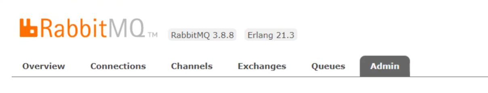
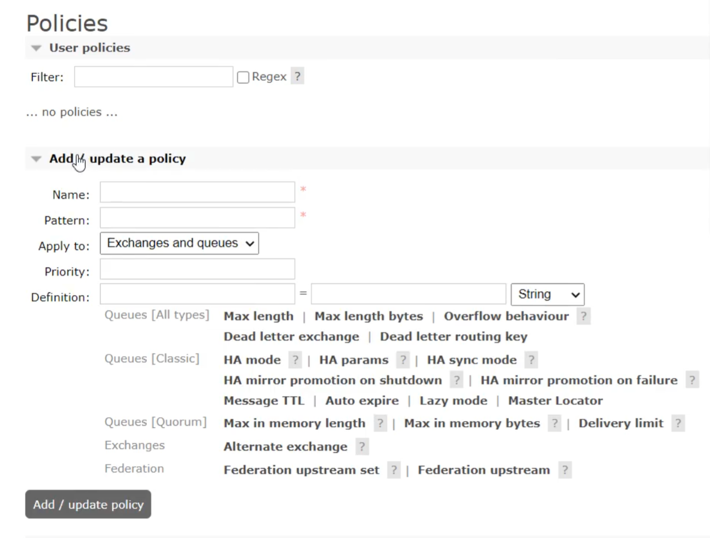
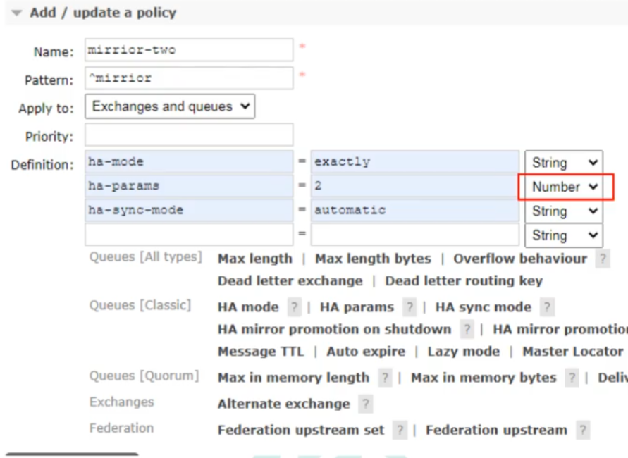

# 镜像队列
创建完集群后，这时候还不能实现备份的能力，需要我们手动使用镜像去开启备份功能   

引入镜像队列的机制，可以将队列镜像到集群中的其他Broker节点之上，如果集群中的一个节点失效了，队列能自动地切换到镜像中的另一个节点上以保证服务的可用性   

搭建完集群后，在RabbitMQ的网页上(15672端口)添加policy    

   

**给/添加策略**

可以看到镜像队列的名字必须以 Pattern中填写的内容开头，比如图片填写的是^mirrior,则队列名类似这样 mirrior_hello才合法  

   

ha  是备份的意思   

