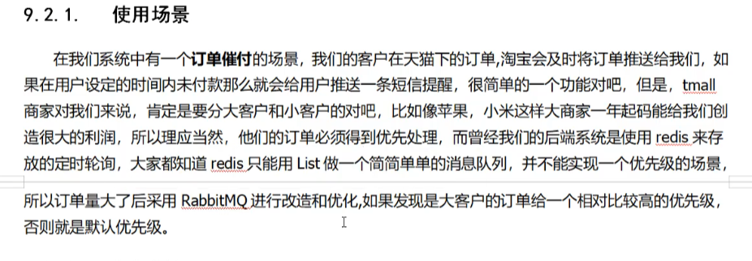
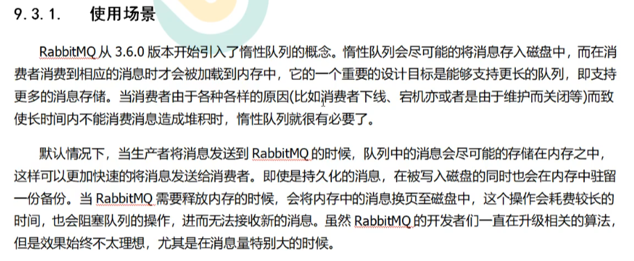

##### RabbitMQ幂等性问题    
幂等性:多次操作的结果是一致的，不会因为多次点击产生副作用      
问到幂等性问题，就是问你如何防止重复消费

解决方案可以用唯一ID     
最佳解决方案是利用Redis的setnx，天生具有幂等性     

### 一些场景题  
1. 订单催付，大客户小客户使用优先级队列    
   

这种情况使用RabbitMQ的优先级队列，队列等级为0-255，数字越大越优先   

把优先队列的使用和面试官说就行   

2. 什么消费者下线宕机啊，维护啊，大量消息积累的时候，就可以使用惰性队列将消息写入到磁盘中      

    
把惰性队列吧啦吧啦全部将给面试官听   

